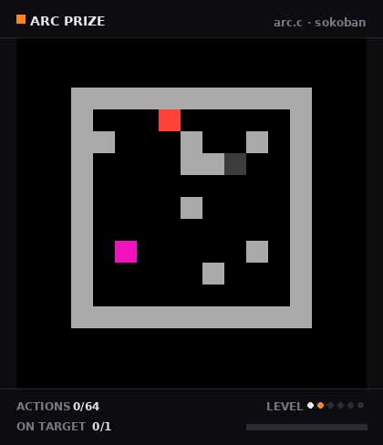
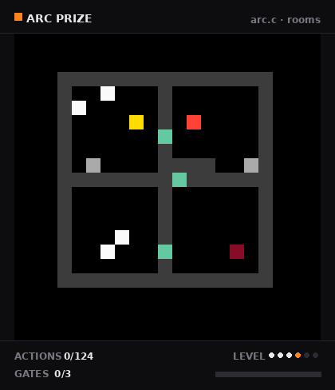
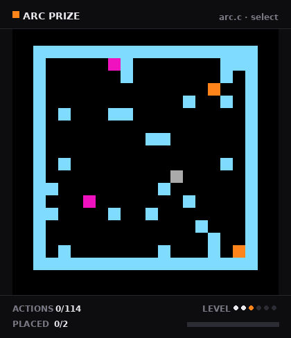
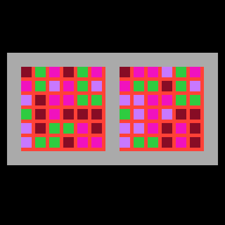

<div align="center">

# ⚡ arc.c

**The ARC-AGI-3 interactive environments, in C.**

A dependency-free C implementation of the [ARC Prize](https://arcprize.org/arc-agi/3) reasoning environments: 25 games, two rendering backends, a batched multi-threaded vector environment, and an optional XLA custom call so JAX can drive it without leaving the compiled program.

Environments are held to **frame-exact** parity with the official
[ARC-AGI Toolkit](https://github.com/arcprize/ARC-AGI), enforced by differential
tests that replay both implementations side by side against the *reference*,
not against a sibling port.

[](https://en.wikipedia.org/wiki/C11_(C_standard_revision))
[](#quickstart)
[](#status)

</div>

---

## Status

All 25 public ARC-AGI-3 environments are implemented. 23 of them are verified
frame-exact against the official Python, every level, 120 actions each:

```
23 games, 164 runs, 19,772 actions and 37,658 frames verified in 19s
```

Two gaps. `g50t` level 5 emits seven frames where the reference emits eight,
the missing one a duplicate of the last. `bp35` and `lf52` run on the scene
backend, which needs a separate construction path in the harness and is not
wired up yet.

`lf52` also cannot be fully verified against the reference in any language: it
calls `np.random.shuffle` on numpy's unseeded global `RandomState`, so that
region is not reproducible between processes.

[docs/benchmark.md](docs/benchmark.md) is the reference for what the
generator in `src/dsl.c` is aiming at: how the Kaggle evaluation scores, what
is known about the hidden set, a mechanic-by-mechanic reading of the 25 public
games, and the DSL's coverage against them.

## Procedural generation

`src/dsl.c` is a small game description language — kinds, layouts, rules,
win conditions — and `harness/generate.py` samples games in it. The point is
not to make puzzles, it is to make a *training distribution*: games that
share no convention an agent could memorise and carry from one to the next.
[docs/benchmark.md](docs/benchmark.md) tracks what it covers, category by
category, against the 25 public games.

Four families, each drawn as a six-level ladder, each shown here being
solved by the C breadth-first solver:

<div align="center">


<br>


</div>

| Family | Mechanic | Closest public games |
|---|---|---|
| `sokoban` | An avatar pushes boxes onto goal tiles; every box must end on a target. Levels are built **backwards**, dragging boxes off their goals, so a solution exists before the level does. | `lp85`, `s5i5`, `wa30` |
| `rooms` | Rooms gated by keys, switches and collectibles, each gate opening the way to the next, with patrolling and chasing hazards. | `dc22`, `ls20`, `tu93` |
| `select` | No avatar. A click or `ACTION5` selects a block, the arrows slide it, and every block must come to rest on a goal. | `cn04`, `ka59`, `sk48` |
| `match` | A canvas on the left, a target on the right. Clicking cycles a cell's colour — with a stencil, its neighbours cycle too, lights-out style. Scrambled backwards from the solved state. | `cd82`, `re86`, `ar25` |

The panel around each frame is drawn **only for these recordings** — an
agent observes the 64x64 grid alone, and the games paint their own budget
bar into it exactly as the public games do (`frame[63, x]`, filled to
`round(64 * steps / budget)`). What the panel reports adapts to the game
type, because progress means something different in each: boxes `ON
TARGET`, `GATES` opened, blocks `PLACED`, canvas `CELLS` matching. Each
reading is computed from the same win condition the engine checks, so it
cannot drift from the game.

```bash
uv run python -m harness.gifs --out docs/media    # panelled, as above
uv run python -m harness.gifs --plain             # the bare 64x64 frames
```

### What a generated game has to pass

A drawn game is a *proposal*, and most proposals are discarded. To be
written into a corpus, all of these have to hold:

| Condition | Checked by | Why |
|---|---|---|
| Every level is solvable | `validate.solve`, the BFS in `src/solve.c` | A level nothing can win is not training data. |
| The optimum lands in the stage's length band | `STAGE_BANDS` | Sets difficulty directly, instead of hoping board size stands in for it. |
| A random policy wins no more than the stage's bar — **1 in 10,000** at stage 2 | `certify` → `arc_certify_random` | The check that actually rules out degenerate levels: if flailing wins, the level teaches nothing. Level 0 is the tutorial and is exempt. |
| Every rule is *enabling*: disable it and the level becomes unsolvable | `validate.necessity` | A rule that merely shortens the solution, or changes nothing, is decoration the agent learns to ignore. |
| Not every actor is *decorative*: at least one moving kind changes the optimum | `validate.necessity` | Keeps hazards and patrols load-bearing rather than scenery. |
| The step budget is 2.5–4.5x the optimum | `BUDGET_RANGE` | Mirrors the public set, where budgets run 1–3x the human baseline. |

`necessity` establishes the last two by ablation: it re-solves the level once
with each rule disabled, and again with each moving kind deleted, and labels
the outcome `enabling`, `constraining`, `decorative` or `unknown`. That is
the expensive half of a build, and the reason a proposal is cheap to draw but
not cheap to keep.

Two further things are randomised per game, because the hidden evaluation set
shares no conventions with the public one either:

- **Controls** — which arrow key moves which way is permuted (`KEY_LAYOUTS`),
  and `ACTION5` is declared but inert half the time, so probing it has to cost
  something.
- **Colours** — the palette is reshuffled on every reset, so colour identity is
  never a stable feature and only colour *relations* survive.

Build a corpus:

```bash
uv run python -c "
from pathlib import Path
from harness.corpus import build_parallel
build_parallel(1000, Path('corpus'), workers=16)"
```

Each game lands as an `.npz` — layouts, kinds, rules, budgets — beside a
`manifest.json` recording its family, stage, per-level optimum, budget and
measured random-play rate. `harness/demos.py` replays the solver's path
through each one to emit behaviour-cloning demonstrations.

## Quickstart

**Requirements:** a C11 compiler.

```bash
git clone git@github.com:noahfarr/arc.c.git
cd arc.c
make -j
```

That builds `libarc`, which has no dependencies at all. `make pgo` does a
profile-guided build.

To check it against the official Python:

```bash
uv run python -m harness           # every game, every level
uv run python -m harness --layout  # struct mirrors vs the compiler
```

The harness needs `arc-agi` and `numpy`, and nothing else. See
[harness/README.md](harness/README.md) for what it checks and why it compares
only against the official implementation.

`make ffi` builds the XLA custom call so JAX can drive the library without
leaving the compiled program. That is the only part of this repo that involves
JAX, and it needs the jax headers: `uv sync --extra ffi`.
